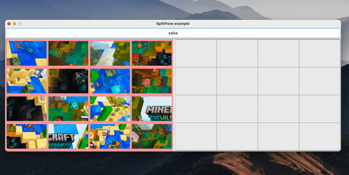

# testTaskPuzzle

### Game options:
1) Quick start with the default image: press ```START```
2) With your custom image: press ```CHOOSE``` then press ```START```
### Prerequisites
- Java 17
- Maven

### Steps to run an Application
1.  ```mvn clean install```
2.  ```java -jar target/puzzle-1.0-SNAPSHOT.jar```

###### In order to run only puzzle solving algorithm - use this repo (https://github.com/dmytrosenyk/testTaskPuzzleAlgorithmSolving)

### Завдання від Devcom
Потрібно написати програму Пазли

#### Вимоги:
- Розробити алгоритм, який розбиває картинку на пазли - не менше 16 шт (будемо вважати, що пазли прямокутної форми), придумати спосіб зручного зберігання інформації про пазли.
  Результатом виконання алгоритму має бути сукупність пазлів, що не перетинаються, об’єднання яких дає вихідну картинку.
- Створити веб або десктопну аплікацію на Java для ручного складання пазлів: пересування пазлів, повороти, перевірка коректності (чи складена послідовність пазлів утворює вихідну картинку).
- Придумати алгоритм для автоматичного складання пазлів.
